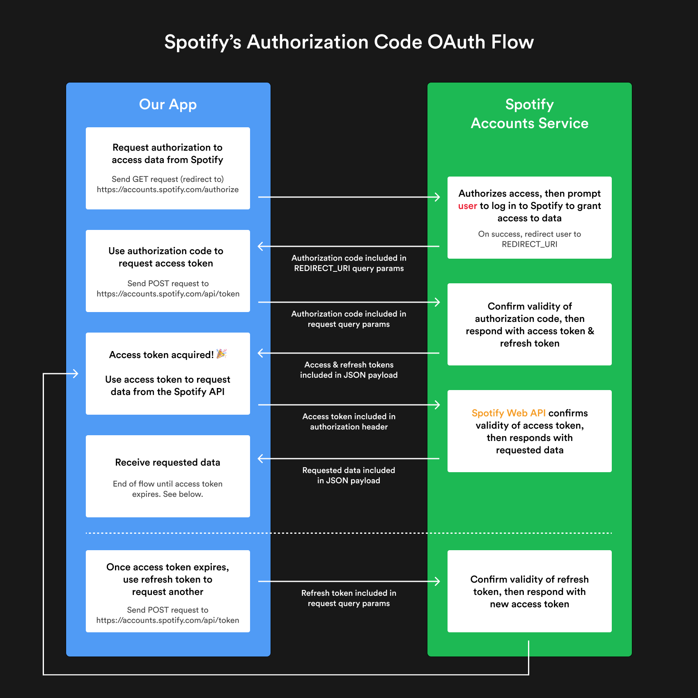

# Build a Spotify connected app with React

<https://www.newline.co/courses/build-a-spotify-connected-app/>

Sporify developer console: <https://developer.spotify.com/dashboard>

Authorization is asking for permission to do things. Authentication is about proving you are the correct person by providing credentials like a username or password.

# Roles

1. Resource Server: The API which stores data the application wants to access (Spotify API)
2. Resource Owner: Owns the data in the resource server (the user who wants to log into our app with Spotify is the owner of their Spotify account)
3. Client: The application that wants to access your data (our app)
4. Authorization Server: The server that receives requests from the client for access tokens and issues them upon successful authentication and consent by the resource owner (Spotify Accounts Service)

# Scopes

1. user-read-private
2. playlist-modify-private
3. user-follow-modify
4. user-read-collaborative
etc..

OAuth is an authorization protocol that lets you approve one application interacting with another on your behalf without giving away user credentials, like your username and password.

Instead of storing usernames and passwords in our app, we'll be using an access token that we obtain via OAuth to send authorized requests to the Spotify API and retrieve data.

# The OAuth Flow

Step 0. Client obtains client ID and client secret
Before any client or server requests are even made, there are two things the client (our app) needs in order to kick off the OAuth flow: the client ID and the client secret. These are two strings that are used to identify and authenticate your specific app when requesting an access token.
With Spotify, your app's unique client ID and client secret can be found in the developer dashboard.

Step 1. Client requests authorization to access data from Sporify
First, the client (our app) sends an authorization request containing the client ID and secret to the authorization server (the Spotify Accounts Service). This request also includes any scopes the client needs and a redirect URI which the authorization server should send the access token to.

Step 2. Spotify authorizes access to client
Second, the authorization server (Spotify) authenticates the client (our app) using the client ID and secret, then verifies that the requested scopes are permitted.

Step 3. User grants app access to their Spotify data
After step 2, the user is redirected to a page on the Spotify authorization server where they can grant the app access to their Spotify account. In our case, the user will have been sent to a page that belongs to the Spotify accounts service (note the accounts.spotify.com URL in the screenshot below), where they can log in to Spotify.

Step 4. Client receives access token from Spotify
Once the user grants access by logging into Spotify, the authorization server redirects the user back to the client (our app) with an access token. Sometimes, a refresh token is also returned with the access token.

Step 5. Client uses access token to request data from Spotify
Finally, the client can use the access token to access resources from the resource server (the Spotify API).

# Spotify's Authorization Flows

According to Spotify's Authorization Guide: <https://developer.spotify.com/documentation/general/guides/authorization-guide/#authorization-flows>, there are four possible flows for obtaining app authorization:

1. Authorization Code Flow
2. Authorization Code Flow With Proof Key for Code Exchange (PKCE)
3. Implicit Grant Flow
4. Client Credentials Flow

Each of these flows provides a slightly different level of authorization due to the way it is granted. For example, the Implicit Grant Flow can be implemented entirely client-side (no server), but it does not provide a refresh token. The Client Credentials Flow is used for server-to-server authentication, but authorization does not grant permission to access user resources. They all follow the OAuth flow we learned in the last lesson, but each has its own variation.

Out of all four of these flows, the Authorization Code Flow is the only one that lets the client access user resources, requires a server-side secret key (an extra layer of security), and provides an access token that can be refreshed. The ability to refresh an access token is a big advantage — users of our app will only need to grant permission once.

<https://www.newline.co/courses/build-a-spotify-connected-app/implementing-the-authorization-code-flow>

![Response from Spotify callback]
{
  "country": "CA",
  "display_name": "username",
  "email": "email@gmail.com",
  "explicit_content": {
    "filter_enabled": false,
    "filter_locked": false
  },
  "external_urls": {
    "spotify": "https://open.spotify.com/user/username"
  },
  "followers": {
    "href": null,
    "total": 2
  },
  "href": "https://api.spotify.com/v1/users/username",
  "id": "username",
  "images": [],
  "product": "premium",
  "type": "user",
  "uri": "spotify:user:username"
}

# Local storage gameplan

We can store our tokens in local storage, a mechanism of the Web Storage API which lets us store key/value pairs in the browser.

Local storage is very similar to session storage, but there's a key difference between the two. Session storage only stores data for the duration of the page session, while local storage stores data even after the browser is closed. In simpler terms, local storage will let us store data in the browser for a particular domain and persist it, even when the user closes the tab or navigates away from our app.

Here's our gameplan for using local storage in our app:

When a user first visits our app, we'll prompt them to log in to Spotify, then store the access token and refresh token from the resulting URL query params in local storage.

Since we know that Spotify's access token will eventually expire after 3600 seconds (1 hour), we'll pre-emptively store a timestamp in local storage to keep track of when the tokens currently in use were stored.

Then, the next time we need to use the access token to make a request to the Spotify API, we'll first check if there is a timestamp and access token stored in local storage. If there is, we'll check if the token is still valid by determining if the amount of time that has elapsed between the timestamp being set and now is greater than 1 hour.

If the access token is still valid, we'll simply use that for our API request.

If the access token has expired, we'll use the refresh token we stored in local storage to request a new access token from Spotify behind the scenes using our Express app's /refresh_token endpoint. When we receive the new token, we'll store it in local storage along with an updated timestamp.

In a nutshell, our app will store four items in local storage:

- Spotify access token
- Spotify refresh token
- Spotify access token expire time (3600 seconds)
- Timestamp of when the access token currently in use was fetched and stored

Whenever our app needs to send a request to the Spotify API with an access token, we'll use the access token we stored in local storage. In the case the token has expired, we'll refresh it in the background using our refresh token from local storage.

Example for playlist: <https://api.spotify.com/v1/playlists/59ZbFPES4>
